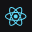
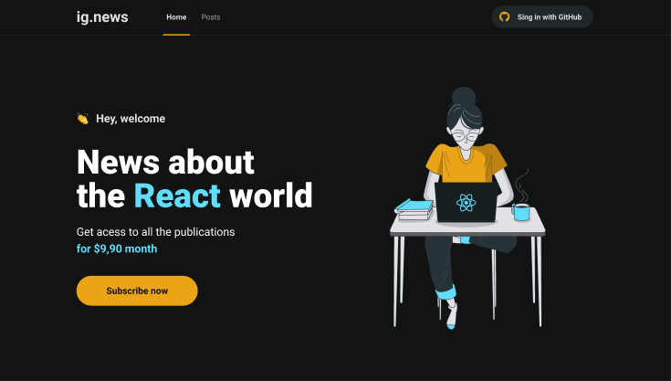

<h1 align="center">
    <a href="https://moveit-gabriel-alexander10.vercel.app/">
        
        
    </a>
</h1>
<p align="center">
    
    
    
    
</p>

<p align="center">
 <a href="#about">About</a> • 
 <a href="#features">Features</a> • 
 <a href="#layout">Layout</a> • 
 <a href="#techs">Techs</a> • 
 <a href="#author">Author</a> • 
 <a href="#license">License</a>
</p>

## About

🚀 Ignews trata-se de uma aplicação para ficar por dentro do que há de mais novo no universo do ReactJs. Faça ja sua assiantura e fique por dentro de todas as novidades! A plataforma do ignews permite ao gestor de conteúdo postar matérias altamente customizaveís, que serão visualizadas somente pelos seus assinantes.

## Features

- [x] O usuário pode criar uma conta na plataforma com o Github
- [x] O usuário realizar uma assinatura de forma mensal para consumir o conteúdo
- [x] SSR (Server side rendering)
- [x] SSG (Static Site Generation)
- [x] Serverless

## Layout
<p align="center">
  
</p> 

Veja o layout completo no 
<a href="https://www.figma.com/file/gl0fHkQgvaUfXNjuwGtDDs/ig.news">
Figma
</a>

## How it works

Primeiro, entre na pasta do projeto. Após isso, basta digitar os seguitnes comandos:
```bash
# intalar as dependências do projeto
yarn
# iniciar a aplicação
yarn dev
```
Abra [http://localhost:3000](http://localhost:3000) no seu navegador e veja o resultado.  
Obs: vale lembrar que para que seja possível utilizar o banco de dados e o serviço de pagamento é necessário criar um arquivo .env.local com as variáveis de ambiente especificadas no arquivo .env.example. O valor dessas variáveis deve ser o mesmo que o valor fornecido tanto pelo FaunaDb quanto pelo Stripe

## Techs

As seguintes tecnologias foram utilizadas no desenvolvimento do projeto:

- [React](https://reactjs.org/)
- [Axios](https://github.com/axios/axios)
- [NextJS](https://nextjs.org/)
- [Next-auth](https://next-auth.js.org/)
- [FaunaDB](https://fauna.com/)
- [Sass](https://sass-lang.com/)
- [Stripe](https://stripe.com/br)
- [Prismic](https://prismic.io/)

## Author

<a href="https://www.linkedin.com/in/gabriel-alexander-abb90a1b6/" >
 
 <br />
 <sub><b>Gabriel Alexander</b></sub></a>    
<br />
<a href="https://www.linkedin.com/in/gabriel-alexander-abb90a1b6/">
    
</a>

## License

This project is under the license [MIT](./LICENSE).
